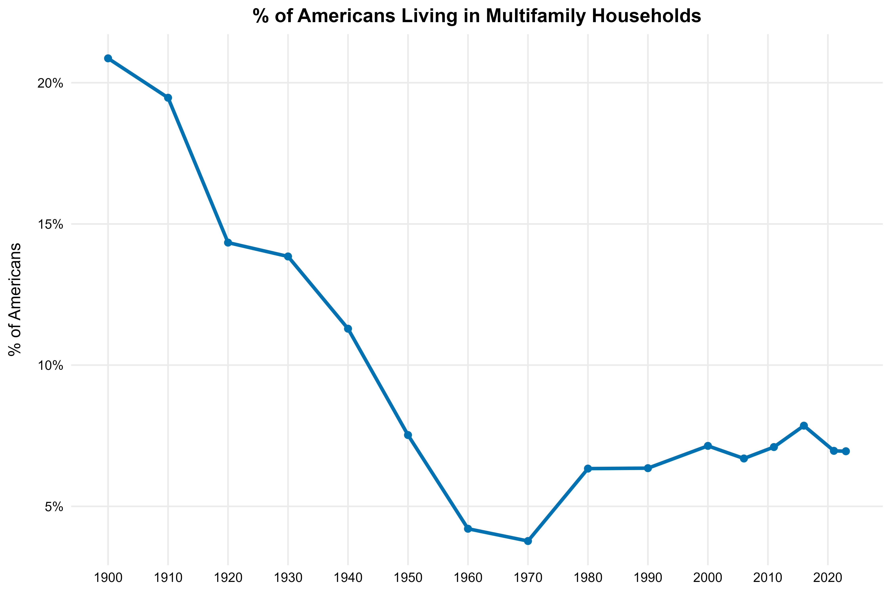

# 👪 👪 Multifamily Households
A multifamily household is one where multiple individual [family units](https://usa.ipums.org/usa-action/variables/NFAMS#description_section), related by blood or marriage, live in same [dwelling unit](https://cps.ipums.org/cps/sample_designs.shtml#:~:text=A%20dwelling%20unit%20is%20a%20room%20or,dwelling%20units%20used%20in%20recent%20U.S.%20censuses.) (e.g. a single house or apartment). Our analysis shows that over 1 in 5 Americans lived in multifamily households in the 1900s, followed by a steep decline through the 20th century until the 1970s, when only 1 in 40 Americans lived in multifamily households. The multifamily share subsequently rose, with roughly 7-8% of Americans living under the same roof as at least one other family as of 2023.



*Who* accounts for this change, and what do our findings reveal about the social, economic, and demographic changes in the United States?  We use publicly available data from American Community Survey and Decennial Census, accessed via IPUMS, alongside the analytical tools in the [demographR](https://github.com/lorae/demographr) package, to answer some of these questions.

## ⚡ Quick Start
For experienced users who just want to get the project running right away. If you
have trouble following these steps, please follow the **Detailed Start** guide below.

1. Navigate to the directory where you want the project to be saved and clone both required repos side by side

    ```bash
    cd your/path/to/parent/directory
    ```

    ```bash
    git clone https://github.com/lorae/multifamily-households multifamily-households
    git clone https://github.com/lorae/demographr demographr
    ```

2. Enter the main project

    ```bash
    cd multifamily-households
    ```

3. Copy the environment file and edit it with your own [IPUMS API key](https://account.ipums.org/api_keys)

    ```bash
    cp example.Renviron .Renviron
    # (Windows PowerShell: Copy-Item example.Renviron .Renviron)
    # IMPORTANT: open .Renviron and replace "your_ipums_api_key" with your actual key
    ```

4. Restore dependencies and run the analysis

    Open `multifamily-households.Rproj` in your preferred IDE, then in the R console:
    
    ```r
    renv::restore()
    source("run-all.R")
    ```
    


## 📎 Detailed Start
Detailed instructions for how to fully install and run this project code on your computer.

###  Part A: Clone the repo and configure the R project

These steps will allow you to install the code on your computer that runs this project and set up the environment so that it mimics the environment on which the code was developed.

1. **Clone the repo**: Open a terminal on your computer. Navigate to the directory you would like to be the parent directory of the repo, then clone the repo.

    MacOS/Linux:
    
    ```bash
    cd your/path/to/parent/directory
    ```
    ```bash
    git clone https://github.com/lorae/multifamily-households multifamily-households
    ```
    
    Windows:
    
    ```cmd
    cd your\path\to\parent\directory
    ```
    ```cmd
    git clone https://github.com/lorae/multifamily-households multifamily-households
    ```

2. **Open the R project**: Navigate into the directory, now located at `your/path/to/parent/directory/multifamily-households`.
Open `multifamily-households.Rproj` using your preferred IDE for R. (We use R Studio.)

    Every subsequent time you work with the project code, you should always open the `multifamily-households.Rproj` file
    at the beginning of your work session. This will avoid common issues with broken file paths or an incorrect working directory.

3. **Initialize R environment**: Install all the dependencies (packages) needed to make the code run on your computer.

    First, ensure you have the package manager, `renv`, installed. Run the following in your R console:
    
    ```r
    install.packages("renv") # Safe to run, even if you're not sure if you already have renv
    ```
    ```r
    library("renv")
    ```
    
    Then restore the project:
    
    ```r
    renv::restore()
    ```

4. **Clone the sibling repo, `demographr`**: This project makes use of a bundle of functions that are unit-tested
and generalized in a package called `demographr`. Clone this repo in the same parent directory where you cloned 
`immigrant-households`.

    🛑 Important: Do not clone this **inside** of the `immigrant-households` repo: instead, it should be a 
    sibling: it should contained in the same folder structure as `multifamily-households`.

    MacOS/Linux:
    
    ```bash
    cd your/path/to/parent/directory
    ```
    ```bash
    git clone https://github.com/lorae/demographr demographr
    ```
    
    Windows:
    
    ```cmd
    cd your\path\to\parent\directory
    ```
    ```cmd
    git clone https://github.com/lorae/demographr demographr
    ```
    
###  Part B: Configure API Access

The [IPUMS Terms of Use](https://www.ipums.org/about/terms) precludes us from directly sharing the raw microdata extract, however,
the data used in this analysis is freely available after setting up an IPUMS USA account, and we provide an automated script that 
writes the API call and downloads the exact data used in this analysis. 

5. **Copy the file** `example.Renviron` to a new file named `.Renviron` in the project root directory. 
You can do this manually or use the following terminal commands:

    MacOS/Linux:
    
    ```bash
    cp example.Renviron .Renviron
    ```
    
    Windows (use PowerShell):
    
    ```ps1
    Copy-Item example.Renviron .Renviron
    ```
    
6. **Set up your IPUMS USA API key**: If you don't already have one, set up a free account on 
[IPUMS USA](https://uma.pop.umn.edu/usa/user/new). Use the new account to login to the 
[IPUMS API key](https://account.ipums.org/api_keys) webpage. Copy your API key from this webpage.

7. **Open `.Renviron`** (‼️**not** `example.Renviron`!) and replace `your_ipums_api_key` with your actual key.  Do not include quotation marks. 
R will automatically load `.Renviron` when you start a new session. This keeps your API key private and separate 
from the codebase.

    🛑 Important: `.Renviron` is listed in `.gitignore`, so it will not be tracked or uploaded to GitHub — but `example.Renviron` is tracked, so do not put your actual API key in the example file.

### Part C: Run the analysis scripts

The code for this project is stored in the `src` folder:

- `scripts/`: executable analysis scripts

- `utils/`: accessory modules (functions), subject to unit tests

8. Run all code by sourcing the `run-all.R` script in your R console:

    ```r
    source("run-all.R")
    ```
    


## 📜 License
MIT License (see LICENSE file).

## 📚 Citation
This repository accompanies ongoing research on households and household size. 

For now, please cite as:  
*Multifamily Households: Replication Code and Analysis*. Maintained by Lorae Stojanovic and Peter Hepburn.  
GitHub. https://github.com/lorae/multifamily-households
